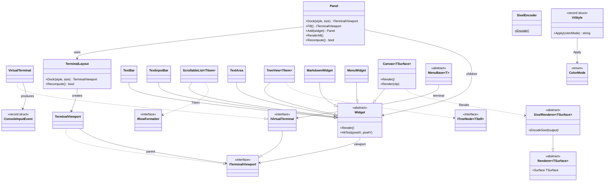

# Console.Lib

A .NET library for building terminal applications with dock-based layouts, widgets, mouse/keyboard input, VT styling, and Sixel graphics rendering. AOT-compatible, targeting .NET 10.

## Architecture overview



## Terminal abstraction

### ITerminalViewport

The core output interface. Represents a rectangular region that supports cursor positioning, text output, and stream access:

```csharp
public interface ITerminalViewport
{
    (int Column, int Row) Offset { get; }
    (int Width, int Height) Size { get; }
    void SetCursorPosition(int left, int top);
    void Write(string text);
    void WriteLine(string? text = null);
    TermCell CellSize { get; }
    (uint Width, uint Height) PixelSize { get; } // default: Size * CellSize
    void Flush();
    Stream OutputStream { get; }
    ColorMode ColorMode => ColorMode.Sgr16; // default: 16-color SGR
}
```

`TermCell` holds the pixel dimensions of a single terminal character cell, queried from the terminal during initialization via the `\e[16t` control sequence.

### TerminalViewportExtensions

Extension methods for `ITerminalViewport`:

```csharp
// Overwrite the current line in-place using \r, padding with spaces to erase stale content.
// Does not advance to the next line — ideal for status prompts and progress indicators.
terminal.WriteInPlace("> waiting...");
```

### IVirtualTerminal

Extends `ITerminalViewport` with full terminal lifecycle: initialization, input reading, alternate screen buffer, and Sixel capability detection.

```csharp
public interface IVirtualTerminal : ITerminalViewport, IAsyncDisposable
{
    Task InitAsync();
    ImageDisplayCapability ImageDisplayCapability { get; }
    bool HasSixelSupport { get; }
    bool HasColorSupport { get; }
    bool IsInputRedirected { get; }   // stdin piped rather than a real terminal
    bool IsOutputRedirected { get; }  // stdout piped rather than a real terminal
    void EnterAlternateScreen();
    bool IsAlternateScreen { get; }
    void Clear();
    bool HasInput();
    ConsoleInputEvent TryReadInput();
}
```

`ImageDisplayCapability` collapses the color + Sixel + `NO_COLOR` signals into a single "how can I show an image here" answer for callers that pick a rendering path:

```csharp
public enum ImageDisplayCapability : byte { NoColor, AsciiBlock, Sixel }
```

`NoColor` (`NO_COLOR` set or no color capability) → plain text; `AsciiBlock` (color but no Sixel) → ASCII/Unicode block characters; `Sixel` → true raster. It is independent of redirection — Sixel bytes can still be written to a pipe, only the `Console.Width`-style layout helpers go away.

`VirtualTerminal` is the concrete implementation backed by `System.Console`. On initialization it:

1. Sets UTF-8 encoding for stdin/stdout
2. Sends a Device Attributes request (`\e[0c`) to detect terminal capabilities (including Sixel support)
3. Sends a cell size query (`\e[16t`) to determine pixel dimensions per character cell

When entering the alternate screen, it enables virtual terminal I/O and mouse input via `WindowsConsoleInput` (Windows only), then enables VT200 mouse tracking with SGR extended coordinates (`\e[?1000h`, `\e[?1006h`), parses SGR mouse events from raw stdin, and normalizes cell coordinates to pixel coordinates using the cell size.

In normal (non-alternate) screen mode, `TryReadInput()` uses `Console.ReadKey(intercept: true)` — keystrokes are not echoed, giving the caller full control over display feedback.

### TerminalViewport

A sub-region of a parent viewport. Translates local coordinates to parent coordinates by adding column/row offsets. Clamps cursor positions to stay within bounds. Viewports can be nested — offsets compose through the parent chain.

```csharp
var terminal = new VirtualTerminal();
// Create a 30x15 viewport starting at column 10, row 5
var viewport = new TerminalViewport(terminal, 10, 5, 30, 15);
viewport.SetCursorPosition(0, 0); // → terminal position (10, 5)
viewport.SetCursorPosition(3, 7); // → terminal position (13, 12)
```

## Layout system

### DockStyle

```csharp
public enum DockStyle { Top, Bottom, Left, Right, Fill }
```

### TerminalLayout

Computes viewport geometries using a dock-based algorithm. Edge-docked panels are allocated first in registration order, each consuming space from the remaining rectangle. The `Fill` panel receives whatever space remains.

The edge arithmetic itself lives once in DIR.Lib's surface-neutral `DockLayout<int>` (measured in cells); `TerminalLayout` delegates to it and keeps only the terminal-specific safety clamp (a docked strip never exceeds the cells still remaining) plus the `TerminalViewport` wiring.

```csharp
var layout = new TerminalLayout(terminal);
var statusBar = layout.Dock(DockStyle.Bottom, 1);  // 1 row at bottom
var sidebar   = layout.Dock(DockStyle.Right, 24);  // 24 columns on right
var main      = layout.Dock(DockStyle.Fill);        // remainder
```

For an 80x24 terminal, this produces:
- `statusBar`: 80x1 at (0, 23)
- `sidebar`: 24x23 at (56, 0)
- `main`: 56x23 at (0, 0)

`Recompute()` recalculates all geometries after a terminal resize, returning `true` if the size actually changed.

### Panel

Higher-level container that wraps `TerminalLayout` and manages a collection of widgets:

```csharp
var panel = new Panel(terminal);

var statusBar = new TextBar(panel.Dock(DockStyle.Bottom, 1));
var history   = new ScrollableList<MyRow>(panel.Dock(DockStyle.Right, 24));
var canvas    = new Canvas(panel.Fill());

panel.Add(statusBar).Add(history).Add(canvas);
panel.RenderAll(); // renders all widgets
```

The two-step pattern (dock creates the viewport, then pass it to a widget constructor) keeps viewport ownership clear — each widget owns exactly one viewport from construction.

### Cell-surface layout (CellLayout)

Beyond docking, Console.Lib can render DIR.Lib's surface-neutral box-layout trees directly to character cells. The arrangeable tree (`Layout.Node` / `Layout.Content`, with per-leaf `Hit` + `OnClick`), the arrange pass (`Layout.Engine.Arrange` → `Layout.ArrangedNode<T>`), and the `Layout.IMeasureContext<T>` abstraction all live in **DIR.Lib** and are shared with the pixel painter. Console.Lib supplies the cell surface:

- **`CellMeasureContext : IMeasureContext<int>`** — measures text width as character count (one row tall) and rounds design-unit scalars to whole cells.
- **`CellLayout.Paint`** — walks the *same* arranged tree the pixel painter uses and writes character cells: `Background` / filled `Box` become runs of spaces with a background SGR (parent-before-children paint order), `Text` writes glyphs foreground-only so the painted background shows through, and `Fill` defers to an app callback.
- **`CellLayout.HitTest`** — reverse-order (top-most wins) hit test mapping a `(column, row)` back to a leaf's `Hit`, firing its `OnClick`. The arranged rectangle *is* the hit region — the same auto-binding guarantee the pixel painter gives.
- **`CellLayout.Describe`** — serialises the arranged tree to an indented, one-line-per-node text dump (nesting reconstructed from `ArrangedNode<T>.Depth`), naming each node kind, leaf content, arranged rect, and `+bg` / `+hit` / `+link(url)` markers. The cell-surface counterpart to the pixel inspector's `describe_layout`; diagnostic only — keep it out of the per-frame paint path.

```csharp
var arranged = Layout.Engine.Arrange(tree, new Rect<int>(0, 0, w, h), new CellMeasureContext());
CellLayout.Paint(viewport, arranged);
var hit = CellLayout.HitTest(arranged, col, row);   // → leaf Hit or null
var dump = CellLayout.Describe(arranged);            // → indented layout-tree text (debug)
```

`MenuWidget` (below) is built on this path; it is the cell-surface counterpart to DIR.Lib's `PixelMenuWidget<TSurface>`.

#### Hyperlinks (4.13+)

A node states a hyperlink by carrying a `HitResult.LinkHit` — the hit it already needed for the click to
work — and `CellLayout` paints that leaf's text inside an OSC 8 pair, so a supporting terminal underlines
it and opens it on click:

```csharp
Layout.Builder.Text(path, 1f, colour).WStar()
    .Clickable(new HitResult.LinkHit($"file:///{path}"), _ => OpenInShell(path));
```

There is no separate `Link` property, deliberately: reusing the hit makes the drawn region and the
clickable region the *same arranged rect*, so a row cannot underline text it cannot click or click text it
does not underline. The link resolves through the same nearest-enclosing walk as `Background` — state it
on a row wrapper and it reaches the text underneath; an inner link overrides an outer one. Only **text**
is wrapped, so the padding and fills around it stay outside the link.

Links survive the diff. `Cell` carries its `Link`, `CellBuffer` parses OSC 8 back rather than treating it
as an escape it cannot model, and `Flush` breaks a run where the target changes and states it through
`ICellSink.SetLink`. This is what makes a list whose *every* row is a link still diff: before 4.13 those
cells were `CellKind.Opaque` and went out again on every frame (`LastFlushOpaqueCells` is the number that
shows it). The console sink emits an `id=`, so a link the diff splits into several runs stays one link.

`ColorMode.None` emits no link, along with every other escape.

#### Trimming an overlong run (4.14+)

A cell surface measures in whole characters, so a run that does not fit its rect has to be cut. Which end
it loses is the run's own business — `Layout.Content.Text.Trim`, via `Layout.Builder.Text(..., trim:)`:

```csharp
Layout.Builder.Text(path, 1f, colour, trim: TextTrim.Start).WStar()   // "…\ftw\Program.cs"
```

`TextTrim.End` (the default, and the historical behaviour) keeps the head — right for a label. A **path**
needs the opposite: every path on a machine shares its head, so `C:\Users\seb\repos\so…` identifies
nothing while `…\ftw\Program.cs` is the part being read. Before this, the only way to get that was to
pre-truncate against the column width — which is exactly the arithmetic rows stopped owning in 4.10.

At a width of one cell there is no room for a glyph *and* an ellipsis, so the cell goes to the surviving
end's character rather than to a lone `…`.

**Across surfaces.** `LinkHit` is a DIR.Lib hit, so the same authored tree carries the link to the pixel
painter too. `PixelWidgetBase.PaintLayout` binds it as a clickable region *and* — from DIR.Lib 7.7 —
routes the text under it through `SelectableTextRegion.Href`, which a DOM host renders as a real
`<a href>`. The two painters resolve the link with the same nearest-enclosing walk, deliberately, so one
tree cannot mean different things per surface:

| surface | a node carrying `LinkHit` |
| --- | --- |
| terminal (`CellLayout`) | clickable + an OSC 8 hyperlink |
| web / DOM host | clickable + a real `<a href>` |
| raster GPU | clickable; no navigation model, so the text just paints |

Console.Lib does not require 7.7 for its own hyperlinks — the two halves are independent.

#### Rounded corners on a character grid

`Layout.Node.Radius(designUnits)` (DIR.Lib 6.21+) rounds a node's background, and `CellLayout` honours
it — so one tree renders rounded on both the pixel and the cell surface:

```csharp
Layout.Builder.VStack(rows).Pad(1).Bg(panelBg).Radius(1f)
```

The approximation is one **three-quadrant block** per corner (`▟ ▙ ▜ ▛`), each omitting the quadrant that
points away from the rect's interior, drawn in the fill colour over the enclosing colour — so the corner
loses a *quarter* cell and reads as clipped.

**A filled rect and a bordered one want different glyphs, and this is the filled one.** Arc glyphs
(`╭ ╮ ╰ ╯`) are what this drew until 4.1, and they are the right answer for an *unfilled* box whose
outline is box-drawing characters — which is exactly what `BorderStyle.Rounded` uses them for below. They
are the wrong answer for a solid fill: an arc is a thin stroke, so a corner cell drawn that way is ~90%
parent colour, and on a high-contrast card that reads as a bite punched out of the shape rather than a
softened corner. There is deliberately no arc branch in `CellLayout` — both fill paths are gated on an
actual fill, and the layout DSL has no border/stroke chrome, so an unfilled rounded box is currently
unexpressible.

**The radius *magnitude* is deliberately ignored here.** A grid cannot round by fractions of a cell, and a
quarter cell is the smallest bite a character grid can express, so any non-zero radius means the same
clip. That is also why `Radius` is documented upstream as a *hint* rather than a guarantee.

Rounding is skipped entirely below 3×3, where the corners are the whole shape and clipping all four would
shape the fill rather than soften it.

#### Hosting a behaviour widget in the tree

The tree can place a widget it cannot describe. A `ScrollableList<T>` (scroll state, thumb), a `Canvas`
(Sixel dirty regions) and a `MarkdownWidget` (its own wrapping) all do things a layout node does not
model — but none of them needs to *place itself*. Give each one a `TerminalViewport`, name it with a
`Fill` leaf, and re-point that viewport at the leaf's arranged rect in the `drawFill` callback:

```csharp
var listViewport = new TerminalViewport(terminal, 0, 0, 0, 0);
var list = new ScrollableList<Row>(listViewport);

CellLayout.Paint(terminal, arranged, (fill, rect) =>
{
    if (fill.Key == "list")
    {
        listViewport.UpdateGeometry(rect.X, rect.Y, rect.Width, rect.Height);
        list.Render();
    }
});
```

So the tree owns placement and the widget owns behaviour. Two things make this work in practice:

- **Re-point, do not reallocate.** `UpdateGeometry` is public for exactly this. The tree is rebuilt every
  frame, so allocating a viewport per `Fill` leaf per frame would churn — and the widget holds a reference
  to the instance anyway.
- **A pixel-backed host must react to a size change.** A Sixel `Canvas` owns a renderer allocated at a
  fixed pixel size, and that size is not knowable until after the arrange. Track the last rect you placed
  it at and rebuild the renderer when it changes; otherwise the surface silently keeps encoding at its
  original size after a terminal resize.

## Widgets

All widgets inherit from `Widget`, which provides:

- **`Viewport`** — the `ITerminalViewport` this widget renders to
- **`Render()`** — abstract method to draw the widget's current state
- **`HitTest(pixelX, pixelY)`** — converts absolute pixel coordinates to viewport-local cell coordinates, returning `null` if outside bounds

### TextBar

Single-line status bar with left-aligned and right-aligned text, styled with `VtStyle`:

```csharp
var bar = new TextBar(viewport);
bar.Text(" Ready")
   .RightText("12.3ms ")
   .Style(new VtStyle(SgrColor.BrightWhite, SgrColor.BrightBlack))
   .Render();
```

### ScrollableList\<TItem\>

Multi-row scrollable list with an optional header. Items must implement `IRowFormatter`:

```csharp
public interface IRowFormatter
{
    string FormatRow(int width, ColorMode colorMode);
}
```

Each item produces its own styled row string (including VT escape codes and padding to full width). The list handles scrolling and empty-row rendering:

```csharp
var list = new ScrollableList<MyRow>(viewport)
    .Header(" Items")
    .HeaderStyle(new VtStyle(SgrColor.BrightWhite, SgrColor.BrightBlack))
    .Items(rows)
    .ScrollTo(startOffset)
    .Render();

int visibleRows = list.VisibleRows; // data rows (excludes header)
```

#### Clickable rows: let the list bind them

`RegisterRowHits` registers a clickable region per visible row against a `ClickableRegionTracker`, so a
host never reconstructs the widget's geometry:

```csharp
list.RegisterRowHits(Tracker,
    hitFor: (itemIndex, item) => item.IsGroupHeader ? null : new HitResult.ListItemHit("row", itemIndex),
    onClick: (itemIndex, _) => Select(itemIndex));
```

Returning `null` from `hitFor` leaves that row unclickable — group headers, separators.

**Do not hand-roll this.** Four things have to be right at once, and each one fails quietly:

- The pixel origin is the viewport **`Offset` times `CellSize`**, not the viewport rect.
- Visible row 0 is item **`ScrollOffset`**, not item 0 — get this wrong and the list selects the right
  row until someone scrolls, then silently selects the wrong item.
- A header steals a row, so data rows start one cell lower.
- The rightmost column belongs to the **scrollbar** whenever one is showing. A row region drawn across
  it wins the hit test, and the thumb can never be grabbed again.

The widget owns the scroll state, so it is the only thing that knows all four without being told.

For **inline buttons on a row** rather than the whole row, `RegisterRowSpanHits` takes column ranges
and shares all of the above:

```csharp
list.RegisterRowSpanHits(Tracker, (itemIndex, item) => item.Buttons
    .Select(b => new RowSpan(b.ColStart, b.ColEnd, new HitResult.ListItemHit("row", itemIndex), b.OnClick))
    .ToArray());
```

`RowSpan.ColumnEnd` is exclusive and clamped to the content width, so `int.MaxValue` is a usable
"to the end of the row" and a span can never spill onto the scrollbar.

### TextArea

Multi-line editable text widget backed by a UTF-8 gap buffer (`GapBuffer`) and editable state (`TextAreaState`). Supports cursor navigation (arrows / Home / End / PgUp / PgDn / Ctrl+Home / Ctrl+End), insertion / Backspace / Delete, sticky desired column for vertical motion, and an optional left-side line-number gutter with vim-style `~` markers past the end of buffer. Cursor moves are codepoint-aware so the cursor never lands mid-UTF-8-sequence.

`HandleChar` consumes the printable codepoint carried by `ConsoleInputEvent.KeyChar` (a `Rune?` populated by `VirtualTerminal` from the UTF-8 byte stream), so non-ASCII input (e.g. `é`, `中`, emoji) round-trips correctly without depending on the US-layout `InputKeyCharMapping` path.

```csharp
var area = new TextArea(viewport).Style(new VtStyle(SgrColor.White, SgrColor.Black));
area.State = new TextAreaState("hello\nworld");

while (true)
{
    area.Render();
    var ev = term.TryReadInput();
    if (!area.HandleKey(ev.Key, ev.Modifiers))
        area.HandleChar(ev);   // printable input via ev.KeyChar (Rune?)
}
```

`TextAreaState` exposes the buffer contents as `ReadOnlySpan<byte>` (`SpanBeforeGap` / `SpanAfterGap`) and `ReadOnlyMemory<byte>` (`MemoryBeforeGap` / `MemoryAfterGap`) for zero-alloc consumers that want to feed the bytes into a lexer / pipe / encoder without materialising the whole text.

### TextInputBar

Single-line editable bar with a styled label, backed by `TextInputState` (cursor + insertion model, history-friendly). Navigation keys route to `TextInputState.HandleKey`; printable codepoints from `ConsoleInputEvent.KeyChar` route to `InsertText`. A reverse-video cursor is drawn at the insertion point.

```csharp
var prompt = new TextInputBar(viewport)
    .Label(":")
    .Style(new VtStyle(SgrColor.BrightWhite, SgrColor.Black));
prompt.State = new TextInputState();
prompt.HandleInput(term.TryReadInput());
prompt.Render();
```

### TreeView\<TItem\>

Scrollable tree widget for hierarchical data. Items implement `ITreeNode<TSelf>` (immediate children + an optional `EnsureChildrenLoaded` hook for lazy population). The widget materialises only the currently visible rows, draws a twirl glyph per expand/collapse state, and shares a scrollbar drag/page model with `ScrollableList<T>`.

```csharp
var tree = new TreeView<DirNode>(viewport)
    .Header(" Files")
    .Root(rootNode)
    .Render();
```

### Canvas\<TSurface\>

A generic widget that owns a `SixelRenderer<TSurface>` and renders it to a viewport. Provides full and partial Sixel output:

```csharp
var canvas = new Canvas<MagickImage>(viewport, renderer);
var (pixelW, pixelH) = canvas.PixelSize;

canvas.Render();       // full Sixel blit
canvas.Render(clip);   // partial blit for dirty region (pixel coordinates)
```

`Render()` positions the cursor at (0, 0) and calls `renderer.EncodeSixel(stream)`. `Render(RectInt clip)` aligns the clip region's Y bounds to cell-height boundaries (since Sixel output must start at a character row), then calls `renderer.EncodeSixel(startY, cropHeight, stream)`. Only vertical clipping is performed — the full image width is always emitted, since the Sixel protocol is a left-to-right band-based format with no horizontal skip.

### MenuWidget

A cell-surface vertical "wizard" menu, built on the [cell-surface layout](#cell-surface-layout-celllayout) path. It wraps DIR.Lib's `MenuModel` (selection / input state) and `MenuLayout.BuildTree` (the layout tree) and paints them via `CellLayout`, retaining the arranged tree so mouse clicks hit-test against the same rects. It is the surface-neutral counterpart to DIR.Lib's `PixelMenuWidget<TSurface>`.

```csharp
var menu = new MenuWidget(viewport);
menu.Reset("Setup", "Choose an option:", ["Quick", "Custom", "Cancel"]);

while (!menu.IsConfirmed)
{
    menu.Render();
    var ev = term.TryReadInput();
    if (ev.Mouse is { } m) menu.HandleMouse(m);          // click to confirm an item
    else menu.HandleKey(/* InputKey from ev */);          // Up/Down/Enter, D1..D9
}
int chosen = menu.SelectedIndex;
```

Use `MenuWidget` when you want an in-layout menu surface (it owns one viewport like any other widget); use [`MenuBase<T>`](#menubaset) for a fullscreen, await-driven prompt with normal-mode fallback.

## Sixel graphics

### SixelRenderer\<TSurface\>

Abstract class extending `Renderer<TSurface>` (from DIR.Lib) with Sixel encoding:

```csharp
public abstract class SixelRenderer<TSurface>(TSurface surface) : Renderer<TSurface>(surface)
{
    public abstract void EncodeSixel(Stream output);
    public abstract void EncodeSixel(int startY, uint height, Stream output);
}
```

Concrete implementations (e.g., `MagickImageRenderer` in Chess.ImageMagick) provide the actual pixel-to-Sixel encoding by extracting raw pixel data and passing it to `SixelEncoder`.

### SixelEncoder

High-performance encoder that converts raw pixel arrays to the Sixel terminal graphics format. Key design decisions:

- **Frequency-based palette**: When more than 256 unique colors exist, the most frequent colors get exact palette slots (preserving large solid areas like board tiles). Remaining colors map to their nearest palette entry.
- **Precomputed sixel grid**: A single row-major pass builds sixel bits for all colors simultaneously, then each color encodes from a contiguous memory slice. This is cache-friendly and avoids the naive O(colors × rows × width) approach.
- **ArrayPool allocation**: All large buffers (index map, sixel grid, palette, output buffer) are rented from `ArrayPool<byte>.Shared`, eliminating GC pressure from repeated allocations.
- **Partial encoding**: Supports vertical slicing without image cloning — the caller extracts the pixel slice and passes the cropped dimensions.

Performance vs ImageMagick's built-in Sixel writer:

| Scenario | ImageMagick | SixelEncoder | Speedup |
|----------|-------------|--------------|---------|
| Full     | 127.3 ms    | 9.1 ms       | 14×     |
| Partial  | 127.9 ms    | 1.6 ms       | 79×     |

#### Encode time scales with content, not palette size

The RLE loop used to walk the full row width for *every* colour present in a band. A colour typically
occupies a handful of columns, so a glyph shade touching 12 pixels still cost an 800-column pass — and a
254-colour surface paid that 254 times per band. Cost therefore scaled with the palette rather than with
the picture.

The diagnosis came from measuring before changing anything: confining each colour to a narrow stripe
shrank the *output* 15× while leaving the runtime flat, which said the cost was the scanning, not the
emitting. Each colour's first and last set column are now found with the vectorised
`IndexOfAnyExcept` / `LastIndexOfAnyExcept`, only that span is RLE'd, and the empty margins are re-emitted
as computed runs — byte-for-byte identical output, because the old loop would have collapsed those margins
into exactly these two runs.

Localised-colour content (text, glyphs, sprites), 800×800, median of 3:

| Colours | Before  | After  | Speedup |
|---------|---------|--------|---------|
| 16      | 10.4 ms | 7.0 ms | 1.5×    |
| 64      | 19.9 ms | 6.0 ms | 3.3×    |
| 254     | 61.7 ms | 9.1 ms | 6.8×    |

**Know which side of this your content falls on.** Localised colour (a chart, a scatter plot, a sprite,
text) is the 3–7× case. Colours spread across the full width — a photograph, a stretched astronomical
frame — have no margins to skip and are unchanged, paying only two extra vectorised passes that are lost
in the noise.

`SixelEncoderTests` pins the byte stream with goldens captured from the pre-change encoder, across palette
size, the transparency sentinel, ragged final bands, degenerate single-row/column bands, and the striped
case this targets. They are what catches an off-by-one in the margin arithmetic, since that shifts the
picture and so changes the bytes.

## Tables and borders

### BorderStyle and BorderChars

`BorderChars.For(style)` resolves the eleven characters a bordered box or table needs — four corners, two
runs, four tees and a cross — for one of `Light`, `Heavy`, `Double`, `Rounded` or `Ascii`.

Two things are worth knowing before reaching for it:

- **`Rounded` is `Light` with arc corners, and that is not a shortcut.** Unicode provides arc forms for the
  four *corners* only (U+256D..U+2570). There is no rounded tee or cross to pair with them, so a rounded
  table's junctions are necessarily the light ones. Every terminal UI that offers the style draws it this
  way.
- **The name is `Border*`, not `Box*`.** `DIR.Lib.MathLayout.BoxStyle` (the math box engine) and
  `BoxRenderMode` (Sixel / Sextant / HalfBlock) already exist. A third `Box` name would collide on the
  first `using`.

### TextTable

Renders a bordered table to VT lines: top border, header, separator, one line per row, bottom border.

```csharp
var lines = new List<string>();
TextTable.Render(
    headers:    ["Name", "Age"],
    rows:       [["Alice", "30"], ["Bob", "5"]],
    alignments: [CellAlignment.Left, CellAlignment.Right],
    output:     lines,
    style:      BorderStyle.Rounded);
```

Cells arrive as **already-formatted strings** that may carry SGR escapes, and column widths are measured
with a `visibleLength` function (defaulting to the ANSI-aware `MarkdownRenderer.VisibleLength`) rather than
`string.Length`. That indirection is the whole point: it is what lets one renderer serve Markdown tables,
whose cells are formatted inline runs, and a plain string table alike — a bold header sizes its column by
the text a reader sees, not by the escape bytes around it.

The junction logic is the part worth having exactly once. The top edge, the header separator and the
bottom edge each need a *different* tee where a column divider meets them; getting one of the four wrong
is invisible until a table happens to be rendered in that style. This code lived as four private methods
inside the Markdown renderer, which is why nothing else in the library could draw a table.

## Styling

### VtStyle, SgrColor, and ColorMode

`VtStyle` stores foreground/background as `RGBAColor32` (from DIR.Lib) and produces escape sequences via `Apply(ColorMode)`:

```csharp
public enum ColorMode : byte { None, Sgr16, TrueColor }

public readonly record struct VtStyle(RGBAColor32 Foreground, RGBAColor32 Background)
{
    public const string Reset = "\e[0m";
    public VtStyle(SgrColor foreground, SgrColor background); // convenience
    public string Apply(ColorMode colorMode);
}
```

`Apply(ColorMode.Sgr16)` emits standard 16-color SGR codes (`\e[97;40m`). `Apply(ColorMode.TrueColor)` emits 24-bit sequences (`\e[38;2;R;G;B;48;2;R;G;Bm`). `ToString()` defaults to `Sgr16` for safe fallback.

The 16 standard `SgrColor` values have well-known RGB mappings via `SgrColor.ToRgba()`. Arbitrary `RGBAColor32` values are mapped back to the nearest `SgrColor` when using `Sgr16` mode.

```csharp
// Construct with SgrColor (convenience) or RGBAColor32 (full control)
var style = new VtStyle(SgrColor.BrightYellow, SgrColor.Blue);
var custom = new VtStyle(new RGBAColor32(0x1a, 0x1a, 0x2e, 0xff), new RGBAColor32(0xe0, 0xe0, 0xe0, 0xff));

// Widgets use Apply with the viewport's color mode
terminal.Write($"{style.Apply(terminal.ColorMode)}Highlighted text{VtStyle.Reset}");
```

`ColorMode` flows through the viewport chain: `VirtualTerminal` returns `TrueColor` when `HasColorSupport` is true (DA capability code 22), `TerminalViewport` delegates to its parent, and `ITerminalViewport` defaults to `Sgr16`. `ColorMode.None` suppresses all escape sequences for plain-text output.

## Markdown rendering

`MarkdownRenderer` converts Markdown to VT-styled terminal output. Parsing is delegated to the LALR.CC inline + block grammars in **DIR.Lib.Markdown** (`MarkdownInline`, `MarkdownBlock`); Console.Lib walks the resulting `MdBlock` / `MdInline` trees and emits the styled lines. Supports headings, bold, italic, links (with OSC 8 hyperlinks for terminals that honour them), tables, lists, horizontal rules, fenced code, inline colored text, inline + display math, `\ce{...}` chemistry notation inside math spans (via `DIR.Lib.Markdown.Mhchem`), and images (`` — see [Image rendering](#image-rendering)).

Colors can be applied to individual words using `[text]{color}` syntax, where `color` is either a named `SgrColor` (e.g. `red`, `BrightCyan`) or a `#RRGGBB` hex literal:

```markdown
This has a [warning]{red} and a [custom tint]{#FF8800}.
```

Colors are resolved at render time based on the active `ColorMode` — in `None` mode, no escape sequences are emitted. Structural element colors (headings, links, bullets, dim, code, math) are configurable via `MarkdownTheme`. Two palettes ship built-in: `MarkdownTheme.Default` (exact 16-color `SgrColor` values, safe everywhere) and `MarkdownTheme.Modern` (a 24-bit GitHub-Dark palette for truecolor terminals — on a 16-color terminal its exact hex tones snap to approximations, so prefer `Default` there). `mdcat` selects between them based on detected color support.

### Math rendering

Inline math (`\(...\)`, `$...$`) always renders as single-row Unicode. Display math (`$$...$$`, `\[...\]`) has three optional modes selectable via the `BoxRenderMode?` parameter on `RenderLines` / `Render`:

| Mode | Density | Requirement |
|---|---|---|
| `Sixel` | True raster, 24-bit colour | Terminal supports Sixel (DA1 capability 4 — query `VirtualTerminal.HasSixelSupport`) |
| `Sextant` | 2×3 sub-cell blocks via Unicode 13 | Modern terminal with sextant glyph coverage |
| `HalfBlock` | 2-row half-blocks | Universal fallback |

Leaving the mode `null` keeps display math on the same single-row Unicode path as inline. The pixel-rendered modes share `BoxRenderer`, which rasterises the LaTeX `Box` tree from `DIR.Lib.MathLayout` and ships it through one of the three encoders. The encoder switch is exposed as `BoxRenderer.EncodeImage(byte[] rgba, int w, int h, BoxRenderMode, TextWriter)`, so any RGBA buffer — math box or decoded image — reuses the same Sixel / sextant / half-block output path.

### Image rendering

Markdown images (``) are opt-in via the `MarkdownImageOptions? images` parameter on `RenderLines` / `Render`:

```csharp
public sealed record MarkdownImageOptions(
    Func<string, byte[]?> Resolver,   // src -> encoded bytes (PNG/JPEG/…), or null to skip
    BoxRenderMode Mode,               // Sixel | Sextant | HalfBlock
    int CellPixelWidth = 10, int CellPixelHeight = 20,
    int MaxRows = 20);
```

- **Standalone vs inline.** An image that is the sole content of a paragraph (on its own line) is rasterized as a block — mirroring how display math rasters while inline math stays text. An image that appears mid-paragraph renders its **alt text** (the line-list output can't splice a multi-row raster mid-line). When `images` is `null`, *every* image renders as alt text (empty alt → the source's file name).
- **Resolution is the host's job.** The renderer never fetches anything; `Resolver` maps a `src` to encoded bytes (e.g. a local file relative to the document) or returns `null` to skip it. Decoding uses `StbImageSharp` (PNG, baseline JPEG, BMP, GIF, …) — already in the dependency closure via DIR.Lib. Unresolvable or undecodable images fall back to alt text and never throw.
- **Sizing.** The image is scaled (aspect preserved, downscale only) to fit the render `width` and `MaxRows`, converted to a pixel budget per mode (`Mode` plus `CellPixelWidth/Height` from `ITerminalViewport.CellSize`).

```csharp
var images = new MarkdownImageOptions(
    src => File.Exists(src) ? File.ReadAllBytes(src) : null,
    BoxRenderMode.Sixel, cellPixelWidth, cellPixelHeight);
var lines = MarkdownRenderer.RenderLines(markdown, width, terminal.ColorMode, images: images);
```

`MarkdownWidget` wraps the renderer as a scrollable viewport widget with automatic re-rendering on resize. It exposes `MathMode` / `MathFontPath` and an `Images` property for the same image options (the same Sixel "size the widget tall enough" caveat applies, since a rasterized image spans several cell rows).

## Input handling

### ConsoleInputEvent

A unified input event that may contain a mouse event, a key press, or both:

```csharp
public readonly record struct ConsoleInputEvent(MouseEvent? Mouse, ConsoleKey Key, ConsoleModifiers Modifiers);
public readonly record struct MouseEvent(int Button, int X, int Y, bool IsRelease);
```

Mouse coordinates are in pixels (normalized using `TermCell` dimensions). Button encoding follows the X11/SGR convention: 0 = left, 1 = middle, 2 = right, 64/65 = scroll up/down.

`ScrollableList<T>` and `TreeView<T>` expose `HandleWheel(int delta)` separately from `HandleMouse(MouseEvent)`. Setting `AutoHandleWheel = true` on either widget makes `HandleMouse` auto-route button 64/65 into `HandleWheel(±WheelStep)` (default step `3`), removing the boilerplate dispatch in hosts that just want plain wheel-to-scroll behavior. Default remains off so existing hosts that bind wheel to non-scroll semantics (e.g. zoom) are unaffected.

`VirtualTerminal.TryReadInput()` parses SGR mouse sequences (`\e[<Pb;Px;Py M/m`) in alternate screen mode, and falls back to `Console.ReadKey` in normal mode. It also parses CSI sequences for arrow keys, function keys, Home/End, Delete, PageUp/PageDown, and SS3 sequences for F1-F4.

## Menus

### MenuBase\<T\>

Abstract base for fullscreen menus with arrow-key navigation, digit shortcuts, and mouse click support. In alternate screen mode, renders a centered menu with resize handling. In normal mode, falls back to a simple numbered list.

```csharp
public class MyMenu(IVirtualTerminal terminal, TimeProvider timeProvider)
    : MenuBase<string>(terminal, timeProvider)
{
    protected override async Task<string> ShowAsyncCore(CancellationToken ct)
    {
        var choice = await ShowMenuAsync("Title", "Pick one:", ["A", "B", "C"], ct);
        return choice switch { 0 => "A", 1 => "B", _ => "C" };
    }
}
```

## Platform support

- **Windows**: `WindowsConsoleInput` enables virtual terminal I/O and mouse tracking via Win32 `SetConsoleMode`. Restores original console mode on dispose.
- **Unix/macOS**: VT100 escape sequences work natively. Mouse tracking uses the same SGR extended format.

## Terminal capability detection

During `InitAsync()`, `VirtualTerminal` sends a Primary Device Attributes request (`\e[0c`). The response contains capability codes parsed into the `TerminalCapability` enum:

| Code | Capability | Effect |
|------|-----------|--------|
| 4    | Sixel graphics | Enables `HasSixelSupport` |
| 22   | Color | Enables `HasColorSupport`, sets `ColorMode` to `TrueColor` |
| 18   | Windowing | — |
| 1    | 132 columns | — |

Unknown capability codes are silently ignored.
