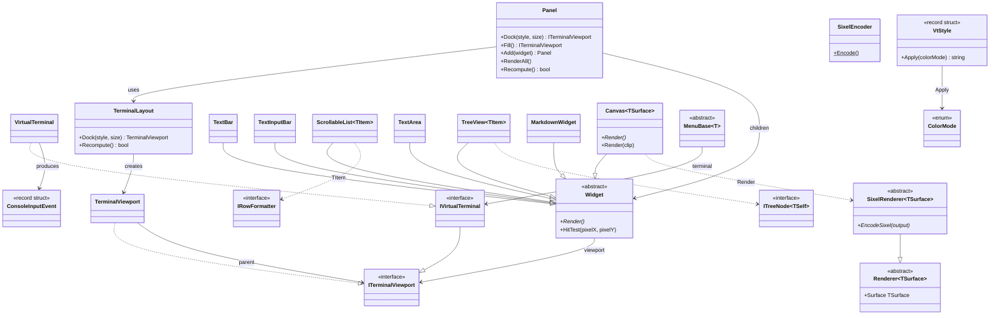

# Console.Lib

A .NET library for building terminal applications with dock-based layouts, widgets, mouse/keyboard input, VT styling, and Sixel graphics rendering. AOT-compatible, targeting .NET 10.

## Architecture overview



## Terminal abstraction

### ITerminalViewport

The core output interface. Represents a rectangular region that supports cursor positioning, text output, and stream access:

```csharp
public interface ITerminalViewport
{
    (int Column, int Row) Offset { get; }
    (int Width, int Height) Size { get; }
    void SetCursorPosition(int left, int top);
    void Write(string text);
    void WriteLine(string? text = null);
    TermCell CellSize { get; }
    (uint Width, uint Height) PixelSize { get; } // default: Size * CellSize
    void Flush();
    Stream OutputStream { get; }
    ColorMode ColorMode => ColorMode.Sgr16; // default: 16-color SGR
}
```

`TermCell` holds the pixel dimensions of a single terminal character cell, queried from the terminal during initialization via the `\e[16t` control sequence.

### TerminalViewportExtensions

Extension methods for `ITerminalViewport`:

```csharp
// Overwrite the current line in-place using \r, padding with spaces to erase stale content.
// Does not advance to the next line — ideal for status prompts and progress indicators.
terminal.WriteInPlace("> waiting...");
```

### IVirtualTerminal

Extends `ITerminalViewport` with full terminal lifecycle: initialization, input reading, alternate screen buffer, and Sixel capability detection.

```csharp
public interface IVirtualTerminal : ITerminalViewport, IAsyncDisposable
{
    Task InitAsync();
    bool HasSixelSupport { get; }
    bool HasColorSupport { get; }
    void EnterAlternateScreen();
    bool IsAlternateScreen { get; }
    void Clear();
    bool HasInput();
    ConsoleInputEvent TryReadInput();
}
```

`VirtualTerminal` is the concrete implementation backed by `System.Console`. On initialization it:

1. Sets UTF-8 encoding for stdin/stdout
2. Sends a Device Attributes request (`\e[0c`) to detect terminal capabilities (including Sixel support)
3. Sends a cell size query (`\e[16t`) to determine pixel dimensions per character cell

When entering the alternate screen, it enables virtual terminal I/O and mouse input via `WindowsConsoleInput` (Windows only), then enables VT200 mouse tracking with SGR extended coordinates (`\e[?1000h`, `\e[?1006h`), parses SGR mouse events from raw stdin, and normalizes cell coordinates to pixel coordinates using the cell size.

In normal (non-alternate) screen mode, `TryReadInput()` uses `Console.ReadKey(intercept: true)` — keystrokes are not echoed, giving the caller full control over display feedback.

### TerminalViewport

A sub-region of a parent viewport. Translates local coordinates to parent coordinates by adding column/row offsets. Clamps cursor positions to stay within bounds. Viewports can be nested — offsets compose through the parent chain.

```csharp
var terminal = new VirtualTerminal();
// Create a 30x15 viewport starting at column 10, row 5
var viewport = new TerminalViewport(terminal, 10, 5, 30, 15);
viewport.SetCursorPosition(0, 0); // → terminal position (10, 5)
viewport.SetCursorPosition(3, 7); // → terminal position (13, 12)
```

## Layout system

### DockStyle

```csharp
public enum DockStyle { Top, Bottom, Left, Right, Fill }
```

### TerminalLayout

Computes viewport geometries using a dock-based algorithm. Edge-docked panels are allocated first in registration order, each consuming space from the remaining rectangle. The `Fill` panel receives whatever space remains.

```csharp
var layout = new TerminalLayout(terminal);
var statusBar = layout.Dock(DockStyle.Bottom, 1);  // 1 row at bottom
var sidebar   = layout.Dock(DockStyle.Right, 24);  // 24 columns on right
var main      = layout.Dock(DockStyle.Fill);        // remainder
```

For an 80x24 terminal, this produces:
- `statusBar`: 80x1 at (0, 23)
- `sidebar`: 24x23 at (56, 0)
- `main`: 56x23 at (0, 0)

`Recompute()` recalculates all geometries after a terminal resize, returning `true` if the size actually changed.

### Panel

Higher-level container that wraps `TerminalLayout` and manages a collection of widgets:

```csharp
var panel = new Panel(terminal);

var statusBar = new TextBar(panel.Dock(DockStyle.Bottom, 1));
var history   = new ScrollableList<MyRow>(panel.Dock(DockStyle.Right, 24));
var canvas    = new Canvas(panel.Fill());

panel.Add(statusBar).Add(history).Add(canvas);
panel.RenderAll(); // renders all widgets
```

The two-step pattern (dock creates the viewport, then pass it to a widget constructor) keeps viewport ownership clear — each widget owns exactly one viewport from construction.

## Widgets

All widgets inherit from `Widget`, which provides:

- **`Viewport`** — the `ITerminalViewport` this widget renders to
- **`Render()`** — abstract method to draw the widget's current state
- **`HitTest(pixelX, pixelY)`** — converts absolute pixel coordinates to viewport-local cell coordinates, returning `null` if outside bounds

### TextBar

Single-line status bar with left-aligned and right-aligned text, styled with `VtStyle`:

```csharp
var bar = new TextBar(viewport);
bar.Text(" Ready")
   .RightText("12.3ms ")
   .Style(new VtStyle(SgrColor.BrightWhite, SgrColor.BrightBlack))
   .Render();
```

### ScrollableList\<TItem\>

Multi-row scrollable list with an optional header. Items must implement `IRowFormatter`:

```csharp
public interface IRowFormatter
{
    string FormatRow(int width, ColorMode colorMode);
}
```

Each item produces its own styled row string (including VT escape codes and padding to full width). The list handles scrolling and empty-row rendering:

```csharp
var list = new ScrollableList<MyRow>(viewport)
    .Header(" Items")
    .HeaderStyle(new VtStyle(SgrColor.BrightWhite, SgrColor.BrightBlack))
    .Items(rows)
    .ScrollTo(startOffset)
    .Render();

int visibleRows = list.VisibleRows; // data rows (excludes header)
```

### TextArea

Multi-line editable text widget backed by a UTF-8 gap buffer (`GapBuffer`) and editable state (`TextAreaState`). Supports cursor navigation (arrows / Home / End / PgUp / PgDn / Ctrl+Home / Ctrl+End), insertion / Backspace / Delete, sticky desired column for vertical motion, and an optional left-side line-number gutter with vim-style `~` markers past the end of buffer. Cursor moves are codepoint-aware so the cursor never lands mid-UTF-8-sequence.

`HandleChar` consumes the printable codepoint carried by `ConsoleInputEvent.KeyChar` (a `Rune?` populated by `VirtualTerminal` from the UTF-8 byte stream), so non-ASCII input (e.g. `é`, `中`, emoji) round-trips correctly without depending on the US-layout `InputKeyCharMapping` path.

```csharp
var area = new TextArea(viewport).Style(new VtStyle(SgrColor.White, SgrColor.Black));
area.State = new TextAreaState("hello\nworld");

while (true)
{
    area.Render();
    var ev = term.TryReadInput();
    if (!area.HandleKey(ev.Key, ev.Modifiers))
        area.HandleChar(ev);   // printable input via ev.KeyChar (Rune?)
}
```

`TextAreaState` exposes the buffer contents as `ReadOnlySpan<byte>` (`SpanBeforeGap` / `SpanAfterGap`) and `ReadOnlyMemory<byte>` (`MemoryBeforeGap` / `MemoryAfterGap`) for zero-alloc consumers that want to feed the bytes into a lexer / pipe / encoder without materialising the whole text.

### TextInputBar

Single-line editable bar with a styled label, backed by `TextInputState` (cursor + insertion model, history-friendly). Navigation keys route to `TextInputState.HandleKey`; printable codepoints from `ConsoleInputEvent.KeyChar` route to `InsertText`. A reverse-video cursor is drawn at the insertion point.

```csharp
var prompt = new TextInputBar(viewport)
    .Label(":")
    .Style(new VtStyle(SgrColor.BrightWhite, SgrColor.Black));
prompt.State = new TextInputState();
prompt.HandleInput(term.TryReadInput());
prompt.Render();
```

### TreeView\<TItem\>

Scrollable tree widget for hierarchical data. Items implement `ITreeNode<TSelf>` (immediate children + an optional `EnsureChildrenLoaded` hook for lazy population). The widget materialises only the currently visible rows, draws a twirl glyph per expand/collapse state, and shares a scrollbar drag/page model with `ScrollableList<T>`.

```csharp
var tree = new TreeView<DirNode>(viewport)
    .Header(" Files")
    .Root(rootNode)
    .Render();
```

### Canvas\<TSurface\>

A generic widget that owns a `SixelRenderer<TSurface>` and renders it to a viewport. Provides full and partial Sixel output:

```csharp
var canvas = new Canvas<MagickImage>(viewport, renderer);
var (pixelW, pixelH) = canvas.PixelSize;

canvas.Render();       // full Sixel blit
canvas.Render(clip);   // partial blit for dirty region (pixel coordinates)
```

`Render()` positions the cursor at (0, 0) and calls `renderer.EncodeSixel(stream)`. `Render(RectInt clip)` aligns the clip region's Y bounds to cell-height boundaries (since Sixel output must start at a character row), then calls `renderer.EncodeSixel(startY, cropHeight, stream)`. Only vertical clipping is performed — the full image width is always emitted, since the Sixel protocol is a left-to-right band-based format with no horizontal skip.

## Sixel graphics

### SixelRenderer\<TSurface\>

Abstract class extending `Renderer<TSurface>` (from DIR.Lib) with Sixel encoding:

```csharp
public abstract class SixelRenderer<TSurface>(TSurface surface) : Renderer<TSurface>(surface)
{
    public abstract void EncodeSixel(Stream output);
    public abstract void EncodeSixel(int startY, uint height, Stream output);
}
```

Concrete implementations (e.g., `MagickImageRenderer` in Chess.ImageMagick) provide the actual pixel-to-Sixel encoding by extracting raw pixel data and passing it to `SixelEncoder`.

### SixelEncoder

High-performance encoder that converts raw pixel arrays to the Sixel terminal graphics format. Key design decisions:

- **Frequency-based palette**: When more than 256 unique colors exist, the most frequent colors get exact palette slots (preserving large solid areas like board tiles). Remaining colors map to their nearest palette entry.
- **Precomputed sixel grid**: A single row-major pass builds sixel bits for all colors simultaneously, then each color encodes from a contiguous memory slice. This is cache-friendly and avoids the naive O(colors × rows × width) approach.
- **ArrayPool allocation**: All large buffers (index map, sixel grid, palette, output buffer) are rented from `ArrayPool<byte>.Shared`, eliminating GC pressure from repeated allocations.
- **Partial encoding**: Supports vertical slicing without image cloning — the caller extracts the pixel slice and passes the cropped dimensions.

Performance vs ImageMagick's built-in Sixel writer:

| Scenario | ImageMagick | SixelEncoder | Speedup |
|----------|-------------|--------------|---------|
| Full     | 127.3 ms    | 9.1 ms       | 14×     |
| Partial  | 127.9 ms    | 1.6 ms       | 79×     |

## Styling

### VtStyle, SgrColor, and ColorMode

`VtStyle` stores foreground/background as `RGBAColor32` (from DIR.Lib) and produces escape sequences via `Apply(ColorMode)`:

```csharp
public enum ColorMode : byte { None, Sgr16, TrueColor }

public readonly record struct VtStyle(RGBAColor32 Foreground, RGBAColor32 Background)
{
    public const string Reset = "\e[0m";
    public VtStyle(SgrColor foreground, SgrColor background); // convenience
    public string Apply(ColorMode colorMode);
}
```

`Apply(ColorMode.Sgr16)` emits standard 16-color SGR codes (`\e[97;40m`). `Apply(ColorMode.TrueColor)` emits 24-bit sequences (`\e[38;2;R;G;B;48;2;R;G;Bm`). `ToString()` defaults to `Sgr16` for safe fallback.

The 16 standard `SgrColor` values have well-known RGB mappings via `SgrColor.ToRgba()`. Arbitrary `RGBAColor32` values are mapped back to the nearest `SgrColor` when using `Sgr16` mode.

```csharp
// Construct with SgrColor (convenience) or RGBAColor32 (full control)
var style = new VtStyle(SgrColor.BrightYellow, SgrColor.Blue);
var custom = new VtStyle(new RGBAColor32(0x1a, 0x1a, 0x2e, 0xff), new RGBAColor32(0xe0, 0xe0, 0xe0, 0xff));

// Widgets use Apply with the viewport's color mode
terminal.Write($"{style.Apply(terminal.ColorMode)}Highlighted text{VtStyle.Reset}");
```

`ColorMode` flows through the viewport chain: `VirtualTerminal` returns `TrueColor` when `HasColorSupport` is true (DA capability code 22), `TerminalViewport` delegates to its parent, and `ITerminalViewport` defaults to `Sgr16`. `ColorMode.None` suppresses all escape sequences for plain-text output.

## Markdown rendering

`MarkdownRenderer` converts Markdown to VT-styled terminal output. Parsing is delegated to the LALR.CC inline + block grammars in **DIR.Lib.Markdown** (`MarkdownInline`, `MarkdownBlock`); Console.Lib walks the resulting `MdBlock` / `MdInline` trees and emits the styled lines. Supports headings, bold, italic, links (with OSC 8 hyperlinks for terminals that honour them), tables, lists, horizontal rules, fenced code, inline colored text, inline + display math, and `\ce{...}` chemistry notation inside math spans (via `DIR.Lib.Markdown.Mhchem`).

Colors can be applied to individual words using `[text]{color}` syntax, where `color` is either a named `SgrColor` (e.g. `red`, `BrightCyan`) or a `#RRGGBB` hex literal:

```markdown
This has a [warning]{red} and a [custom tint]{#FF8800}.
```

Colors are resolved at render time based on the active `ColorMode` — in `None` mode, no escape sequences are emitted. Structural element colors (headings, links, bullets) are configurable via `MarkdownTheme`.

### Math rendering

Inline math (`\(...\)`, `$...$`) always renders as single-row Unicode. Display math (`$$...$$`, `\[...\]`) has three optional modes selectable via the `BoxRenderMode?` parameter on `RenderLines` / `Render`:

| Mode | Density | Requirement |
|---|---|---|
| `Sixel` | True raster, 24-bit colour | Terminal supports Sixel (DA1 capability 4 — query `VirtualTerminal.HasSixelSupport`) |
| `Sextant` | 2×3 sub-cell blocks via Unicode 13 | Modern terminal with sextant glyph coverage |
| `HalfBlock` | 2-row half-blocks | Universal fallback |

Leaving the mode `null` keeps display math on the same single-row Unicode path as inline. The pixel-rendered modes share `BoxRenderer`, which rasterises the LaTeX `Box` tree from `DIR.Lib.MathLayout` and ships it through one of the three encoders.

`MarkdownWidget` wraps the renderer as a scrollable viewport widget with automatic re-rendering on resize.

## Input handling

### ConsoleInputEvent

A unified input event that may contain a mouse event, a key press, or both:

```csharp
public readonly record struct ConsoleInputEvent(MouseEvent? Mouse, ConsoleKey Key, ConsoleModifiers Modifiers);
public readonly record struct MouseEvent(int Button, int X, int Y, bool IsRelease);
```

Mouse coordinates are in pixels (normalized using `TermCell` dimensions). Button encoding follows the X11/SGR convention: 0 = left, 1 = middle, 2 = right, 64/65 = scroll up/down.

`ScrollableList<T>` and `TreeView<T>` expose `HandleWheel(int delta)` separately from `HandleMouse(MouseEvent)`. Setting `AutoHandleWheel = true` on either widget makes `HandleMouse` auto-route button 64/65 into `HandleWheel(±WheelStep)` (default step `3`), removing the boilerplate dispatch in hosts that just want plain wheel-to-scroll behavior. Default remains off so existing hosts that bind wheel to non-scroll semantics (e.g. zoom) are unaffected.

`VirtualTerminal.TryReadInput()` parses SGR mouse sequences (`\e[<Pb;Px;Py M/m`) in alternate screen mode, and falls back to `Console.ReadKey` in normal mode. It also parses CSI sequences for arrow keys, function keys, Home/End, Delete, PageUp/PageDown, and SS3 sequences for F1-F4.

## Menus

### MenuBase\<T\>

Abstract base for fullscreen menus with arrow-key navigation, digit shortcuts, and mouse click support. In alternate screen mode, renders a centered menu with resize handling. In normal mode, falls back to a simple numbered list.

```csharp
public class MyMenu(IVirtualTerminal terminal, TimeProvider timeProvider)
    : MenuBase<string>(terminal, timeProvider)
{
    protected override async Task<string> ShowAsyncCore(CancellationToken ct)
    {
        var choice = await ShowMenuAsync("Title", "Pick one:", ["A", "B", "C"], ct);
        return choice switch { 0 => "A", 1 => "B", _ => "C" };
    }
}
```

## Platform support

- **Windows**: `WindowsConsoleInput` enables virtual terminal I/O and mouse tracking via Win32 `SetConsoleMode`. Restores original console mode on dispose.
- **Unix/macOS**: VT100 escape sequences work natively. Mouse tracking uses the same SGR extended format.

## Terminal capability detection

During `InitAsync()`, `VirtualTerminal` sends a Primary Device Attributes request (`\e[0c`). The response contains capability codes parsed into the `TerminalCapability` enum:

| Code | Capability | Effect |
|------|-----------|--------|
| 4    | Sixel graphics | Enables `HasSixelSupport` |
| 22   | Color | Enables `HasColorSupport`, sets `ColorMode` to `TrueColor` |
| 18   | Windowing | — |
| 1    | 132 columns | — |

Unknown capability codes are silently ignored.
